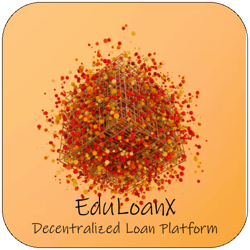

# EduLoanX: Decentralized Student Loan Platform



## 🎓 About EduLoanX

EduLoanX is a decentralized student loan platform developed during the EduChain Hackathon. It aims to revolutionize education financing by leveraging blockchain technology to provide transparent and fair lending practices for students.

## 🌟 Key Features

- **Decentralized Lending**: Utilizes smart contracts on the Ethereum blockchain for peer-to-peer student loans.
- **Dual User Roles**: Supports both Bank (admin) and Beneficiary-Student user types.
- **Token-Based Loan Management**: Uses ERC-20 tokens to represent and manage loan funds.
- **User-Friendly Dashboard**: Provides an intuitive overview of loan balances and repayment status.
- **Seamless Authentication**: Integrates with MetaMask for secure user authentication.

## Architecture


#### The architecture and flow of the EduLoanX platform, a decentralized student loan system. Let's break down the components and their interactions:

### Lender:
Provides liquidity to the Aave Protocol
Mints Sponsor Tokens (ERC-20) to represent their contribution

### Sponsor Token (ERC-20):
Represents the funds provided by lenders
Manages sponsor funds within the system

### Aave Protocol:
Receives liquidity from lenders
Likely used for efficient fund management and potential interest generation

### EduLoanX Smart Contracts:
Central component that interacts with most other parts of the system
Manages sponsor funds, student funds, and overall loan operations
Interacts with the EduLoanX Frontend for user operations
Uses Chainlink Oracles for income/employment verification
Transfers tokens between different parts of the system

### Chainlink Oracles:
Verifies income and employment information of students
Provides external data to smart contracts for decision-making

### Student Token (ERC-20):
Represents the loan amount given to students
Managed by EduLoanX Smart Contracts

### MetaMask:
Provides authentication for users interacting with the EduLoanX Frontend

### EduLoanX Frontend:
User interface for students and lenders to interact with the system
Communicates with EduLoanX Smart Contracts to execute operations

### Student:
Applies for loans through the EduLoanX Frontend
Receives Student Tokens representing their loan

### Income Source:
Reports income information to Chainlink Oracles for verification

> This architecture showcases a comprehensive decentralized finance (DeFi) approach to student loans, leveraging blockchain  > technology, smart contracts, and oracles to create a transparent, efficient, and potentially more accessible loan system  
> for students. The use of ERC-20 tokens for both sponsors and students allows for easy tracking and management of funds,  
> while the integration with Aave and Chainlink provides additional functionality and data verification capabilities.

## 🛠 Technology Stack

- **Frontend**: Next.js with React
- **Styling**: Tailwind CSS for responsive design
- **Blockchain**: Ethereum (Sepolia Testnet)
- **Smart Contracts**: Solidity
- **Authentication**: Privy for web3 authentication
- **State Management**: React Hooks

## 💡 Core Functionalities

### User Authentication
- Users can connect using MetaMask wallet.
- Supports two user types: Bank (admin) and Beneficiary-Student.

### Dashboard Overview
- Displays current loan balance and total repaid amount.
- Shows next payment due date and interest rate.
- Provides quick access to loan application and repayment functions.

### Loan Management
- Students can apply for loans through the platform.
- Admins (Banks) can approve loan applications.
- Automated loan issuance using smart contracts.

### Token Interactions
- Implements ERC-20 tokens for managing loan funds.
- Supports token minting, burning, and transfer operations.

### Repayment Handling
- Students can make loan repayments through the platform.
- Automatic updating of loan balances and repayment status.

## 🚀 Getting Started

### Prerequisites
- Node.js (`v16` or later)
- MetaMask browser extension
- Ethereum wallet with Sepolia testnet ETH

### Installation

1. Clone the repository:
   ```
   git clone https://github.com/DevJSter/eduloanx.git
   ```

2. Navigate to the project directory:
   ```
   cd eduloanx
   ```

3. Install dependencies:
   ```
   npm install
   ```

4. Set up environment variables:
   - Create a `.env.local` file in the root directory
   - Add necessary environment variables (refer to `.env.example`)

5. Run the development server:
   ```
   npm run dev
   ```

6. Open [http://localhost:3000](http://localhost:3000) in your browser to view the application.

## 📚 Usage

1. Connect your MetaMask wallet to the application.
2. Choose your role (Bank or Beneficiary-Student).
3. For students:
   - View your current loan balance and repayment status.
   - Apply for a new loan or make repayments on existing loans.
4. For banks:
   - Review and approve loan applications.
   - Monitor overall lending activities.

## 🏆 EduChain Hackathon

EduLoanX was developed as part of the EduChain Hackathon, showcasing innovative blockchain solutions in education financing.

## 📞 Contact

For any queries or support, please contact us at [shubht3303@gmial.com](mailto:shubht3303@gmail.com)

---

Built with ❤️ for students worldwide | EduLoanX Team
